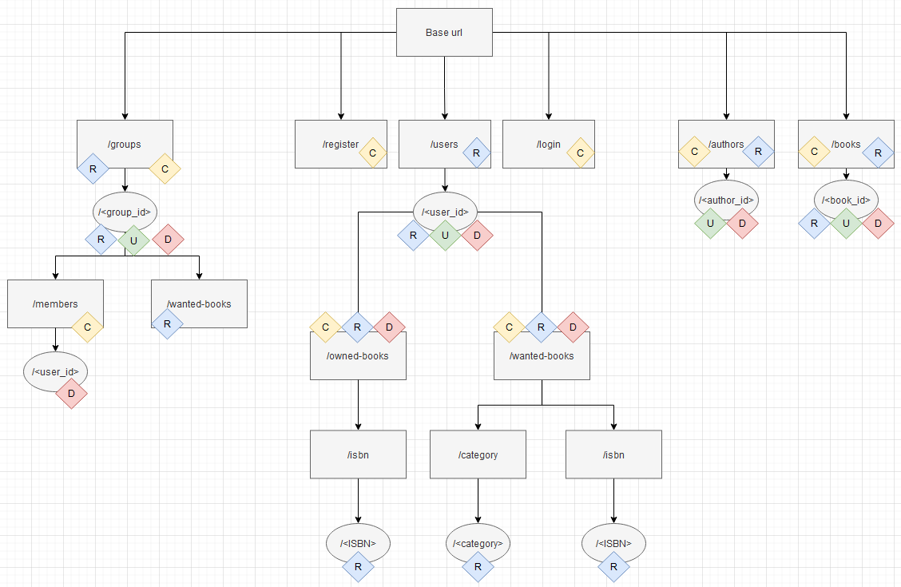

# T2A2-API-Webserver-Project

R1 	Identification of the problem you are trying to solve by building this particular app.
R2 	Why is it a problem that needs solving?
R3 	Why have you chosen this database system. What are the drawbacks compared to others?
R4 	Identify and discuss the key functionalities and benefits of an ORM
R5 	Document all endpoints for your API
R6 	An ERD for your app
R7 	Detail any third party services that your app will use
R8 	Describe your projects models in terms of the relationships they have with each other
R9 	Discuss the database relations to be implemented in your application
R10 	Describe the way tasks are allocated and tracked in your project

# R1 Problem Identification.
The explicit use case for this is the Lifeline Bookfest (big second hand book sale). I usually go with a vague idea that I'm looking for certain series / authors, but never remember which ones I actually own (which is why I have 3 copies  of a Clash of Kings, but still haven't replaced my copy of Storm of Swords after someone borrowed it forever)


# R2 Why is it a problem that needs solving?


# R3 Why have you chosen this database system. What are the drawbacks compared to others?


# R4 Identify and discuss the key functionalities and benefits of an ORM


# R5 API Endpoints
The figure below outlines the Endpoint Routes for the API
 

## 1. /login (POST)
* __HTTP Request Verb:__ POST
* __Required body:__ username, password
* __Expected response Code:__ 200, OK
* __Expected response Data:__ Username and JWT bearer token
* __Authentication methods:__ username & password
* __Description:__ Allows user to login to app.


## 2. /register (POST) 
* __HTTP Request Verb:__ POST
* __Required body:__ username, password
* __Optional data:__ email
* __Expected response Code:__ 201, Created
* __Expected response Data:__ id, username, email & login token
* __Description:__ Allows user to create an account. Returns bearer token (automatically logs in new user)

 

## 3. /users/ (GET)
* __HTTP Request Verb:__ GET
* __Required body:__ N/A
* __Expected response Code:__ 200 OK
* __Expected response Data:__ User data for all users (id, username, email, groups)
* __Authentication methods:__ JWT Bearer token, is_admin
* __Description:__ Admin only: Retrieves details of all users

 


## 4. /users/<user_id> (GET)
* __HTTP Request Verb:__ POST
* __Required body:__ N/A 
* __Expected response Code:__ 200 OK
* __Expected response Data:__ data for single user (id, username, email, groups)
* __Authentication methods:__ JWT Token, must be user user_id or admin
* __Description:__ allows a logged in user (or admin) to see their own user details

 


## 5. /users/<user_id> (PATCH, PUT) 
* __HTTP Request Verb:__ PATCH, PUT
* __Required body:__ Optional fields: password, email
* __Expected response Code:__ 200 OK
* __Expected response Data:__ updated user data (id, username, email)
* __Authentication methods:__ JWT Token, must be user user_id or admin
* __Description:__ Allows user (or an admin) to change their email or password. 

 


## 6. /users/<user_id> (DELETE) 
* __HTTP Request Verb:__ DELETE
* __Required body:__ N/A
* __Expected response Code:__ 204, No Content
* __Expected response Data:__ N/A
* __Authentication methods:__ JWT Token, must be user user_id or admin
* __Description:__ Deletes account with user id <user_id> (user user_id or admin only)

 


## 7. /users/<user_id>/owned-books/ (GET)
* __HTTP Request Verb:__ GET
* __Required body:__ N/A
* __Expected response Code:__ 200 OK
* __Expected response Data:__ owned_books: [list of nested book details]
* __Authentication methods:__ JWT Token, must be user user_id or admin
* __Description:__ returns a list of all the book titles owned by the user user_id. (user <user_id> or admin)

 


## 8. /users/<user_id>/owned-books/ (POST)
* __HTTP Request Verb:__ POST
* __Required body:__ input data required = [book_id]
* __Expected response Code:__ 201, CREATED
* __Expected response Data:__ details of book that was added to owned books
* __Authentication methods:__ JWT Token, must be user user_id or admin
* __Description:__ Adds a book to <user_id> owned books

 


## 9. /users/<user_id>/owned-books/<book_id> (DELETE)
* __HTTP Request Verb:__ DELETE
* __Required body:__ N/A
* __Expected response Code:__ 204, No Content
* __Expected response Data:__ N/A
* __Authentication methods:__ JWT Token, must be user user_id or admin
* __Description:__ removes a book entry from owned books

 


# 10. /users/<user_id>/owned-books/isbn/<isbn> (GET)
* __HTTP Request Verb:__ GET
* __Required body:__ N/A
* __Expected response Code:__ 200 OK
* __Expected response Data:__ {} or book details
* __Authentication methods:__ JWT Token, must be user user_id or admin
* __Description:__ Allows user to enter the ISBN of a book and see if it is in their owned_books. Will return {} if book not in owned books or the book details if it is in <user_id> owned_books. 
_Note: if ISBN is not in books table will return a 404 error._

 


## 11. /users/<user_id>/wanted-books/ (GET)
* __HTTP Request Verb:__ GET
* __Required body:__ N/A
* __Expected response Code:__ 200, OK
* __Expected response Data:__ nested list books in <user_id>'s wanted books
* __Authentication methods:__ JWT Token, must be user user_id or admin
* __Description:__ Returns list of books that are in <user_id> wanted_books list

 


## 12. /users/<user_id>/wanted-books/ (POST)
* __HTTP Request Verb:__ POST, PATCH, or PUT
* __Required body:__ required: book_id(int), Optional: quality(must be "any", "fair", "good", "mint". default value = "any")
* __Expected response Code:__ 201, CREATED
* __Expected response Data:__ returns book details & quality
* __Authentication methods:__ JWT Token, must be user user_id or admin
* __Description:__ Adds book to <user_ids> wanted book list.

 


## 13. /users/<user_id>/wanted-books/<book_id> (DELETE)
* __HTTP Request Verb:__ DELETE
* __Required body:__ N/A
* __Expected response Code:__ 204, NO CONTENT
* __Expected response Data:__ N/A
* __Authentication methods:__ JWT Token, must be user user_id or admin
* __Description:__ Removes book from user_id wanted books list.

 


## 14. /users/<user_id>/wanted-books/categories/<category> (GET)
* __HTTP Request Verb:__ GET
* __Required body:__ N/A
* __Expected response Code:__ 200, OK
* __Expected response Data:__ Nested list of books in users wanted_books list in requested category
* __Authentication methods:__ JWT Token
* __Description:__ Returns <user_id> wanted books in specified <category>.  

 


## 15. /users/<user_id>/wanted-books/isbn/<isbn> (GET)
* __HTTP Request Verb:__ POST
* __Required body:__ N/A
* __Expected response Code:__ 200, OK
* __Expected response Data:__ Book details & quality wanted if book in users wanted list, else no content {}.
* __Authentication methods:__ JWT Token
* __Description:__ Allows user to enter book ISBN and see if the book is in <user_id> wanted books list.

 


## 16. /books/ (POST)
* __HTTP Request Verb:__ POST
* __Required body:__ required fields =[title, isbns(list), author_ids(list)] optional fields =[series, category]
* __Expected response Code:__ 201, CREATED
* __Expected response Data:__ book details, fields [id, title, category, series, isbns(nested list), author_ids(nested list)]
* __Authentication methods:__ JWT Token
* __Description:__ Adds a book to the database, will also add associated entries in the book_authors table, and isbns table.

 


## 17. /books/ (GET) 
* __HTTP Request Verb:__ GET
* __Required body:__ N/A
* __Expected response Code:__ 200, OK
* __Expected response Data:__ All books in the database fields [id, title, category, series, isbns(nested list), author_ids(nested list)]
* __Authentication methods:__ JWT Bearer token, Admin only
* __Description:__ Returns all books in database.

 


## 18. /books/<book_id> (GET) 
* __HTTP Request Verb:__ GET
* __Required body:__ N/A
* __Expected response Code:__ 200, OK
* __Expected response Data:__ <book_id> details: fields[id, title, category, series, isbns(nested list), author_ids(nested list)]
* __Authentication methods:__ JWT Bearer token
* __Description:__ Gets a single book details based on <book_id>.

 


## 19. /books/<book_id> (PATCH)
* __HTTP Request Verb:__ PATCH
* __Required body:__ optional fields =[title, isbns(list), author_ids(list)] optional fields =[series, category]
* __Expected response Code:__ 200, OK
* __Expected response Data:__ book details, fields [id, title, category, series, isbns(nested list), author_ids(nested list)]
* __Authentication methods:__ JWT Token, Admin only
* __Description:__ updates book record in the database, will also add associated entries in the book_authors table, and isbns table.

 


## 20. /books/<book_id> (DELETE) 
* __HTTP Request Verb:__ DELETE
* __Required body:__ N/A
* __Expected response Code:__ 204, No Content
* __Expected response Data:__ N/A
* __Authentication methods:__ JWT Token, Admin only
* __Description:__ Deletes book record from database.

 

## 21. /authors/ (GET) 
* __HTTP Request Verb:__ GET
* __Required body:__ N/A
* __Expected response Code:__ 200, OK
* __Expected response Data:__ list of authors (nested[id, surname, given_names])
* __Authentication methods:__ JWT Bearer token required
* __Description:__ Returns a list of authors & details in the database.

 

## 22. /authors/ (POST) 
* __HTTP Request Verb:__ POST
* __Required body:__ required fields = [surname] optional fields = [given_names]
* __Expected response Code:__ 201, CREATED
* __Expected response Data:__ author details [id, surname, given_names]
* __Authentication methods:__ JWT Bearer token, Admin only
* __Description:__ Adds a new Author to the database.

 

## 23. /authors/<author_id> (PATCH, PUT) 
* __HTTP Request Verb:__ PATCH, PUT
* __Required body:__ optional fields = [surname, given_names]
* __Expected response Code:__ 200, OK
* __Expected response Data:__ author details [id, surname, given_names]
* __Authentication methods:__ JWT Bearer token, Admin only
* __Description:__ Updates an existing author in the database.

 

## 24. /authors/<author_id> (DELETE) 
* __HTTP Request Verb:__ DELETE
* __Required body:__ N/A
* __Expected response Code:__ 204, NO CONTENT
* __Expected response Data:__ N/A
* __Authentication methods:__ JWT Bearer token, Admin only
* __Description:__ Deletes author from database (will cascade delete any entries in book_author table where author id = <author_id>)

 

## 25. /groups/ (GET)
* __HTTP Request Verb:__ GET
* __Required body:__ N/A
* __Expected response Code:__ 200, OK
* __Expected response fields:__ all groups(id, name, users(id, username), admin_id)
* __Authentication methods:__ JWT Bearer token, Admin only
* __Description:__ Returns a list of all groups and their members.

 

## 26. /groups/<group_id> (GET) 
* __HTTP Request Verb:__ GET
* __Required body:__ N/A
* __Expected response Code:__ 200, OK
* __Expected response Data:__ group (id, name, users(id, username), admin_id)
* __Authentication methods:__ JWT Bearer token 
* __Description:__ Returns <group_id> details

 

## 27. /groups/ (POST) 
* __HTTP Request Verb:__ POST
* __Required body:__ Required = [name], optional = [password, admin_id]
* __Expected response Code:__ 201, CREATED
* __Expected response Data:__ Selected Group details. Fields: group(id, name, users(id, username), admin_id)
* __Authentication methods:__ JWT Bearer token 
* __Description:__ Creates a group (and adds group creator user_id as member). If not admin_id is provided, default is the user id associated with the JWT Bearer Token. If no password is provided the group will be open for any user to join.

 

## 28. /groups/<group_id> (DELETE) 
* __HTTP Request Verb:__ DELETE
* __Required body:__ N/A
* __Expected response Code:__ 204, No CONTENT
* __Expected response Data:__ N/A
* __Authentication methods:__ JWT Bearer token, admin or group admin
* __Description:__ Deletes group, delete cascades related records in user_group table.

 

## 29. /groups/<group_id> (PATCH, PUT) 
* __HTTP Request Verb:__ PATCH, PUT
* __Required body:__ Optional fields [name, password, admin_id]
* __Expected response Code:__ 200, OK
* __Expected response Data:__ Updated group details. Fields: group(id, name, admin_id)
* __Authentication methods:__ JWT Bearer token, admin or group admin
* __Description:__ Updates group details: name, password, group administrator

 


## 30. /groups/<group_id> (POST) 
* __HTTP Request Verb:__ POST
* __Required body:__ required fields [password]
* __Expected response Code:__ 201, CREATED
* __Expected response Data:__ Joined Group details. Fields: group(id, name, users(id, username), admin_id)
* __Authentication methods:__  JWT Bearer token, password
* __Description:__ Join group <group_id>. Requires group password if one has been set by group admin. 

 


## 31. /groups/<group_id>/members/<user_id> (DELETE)
* __HTTP Request Verb:__ DELETE
* __Required body:__ N/A
* __Expected response Code:__  204, NO CONTENT
* __Expected response Data:__ N/A
* __Authentication methods:__ JWT Bearer token, is user or group admin or admin
* __Description:__ Removes member from group. Can be performed by the user being removed, group admin ot DB administrator

 


## 32. /groups/<group_id>/wanted_books (GET) 

* __HTTP Request Verb:__ GET
* __Required body:__ N/A
* __Expected response Code:__ 200, OK
* __Expected response Data:__ List of users and all wanted books: [username, wanted_book(book(book details), quality), ]
* __Authentication methods:__ JWT Bearer token. Is group member or admin
* __Description:__ Returns all the books in the group members wanted_books lists

 


# R6 An ERD for your app
 

# R7 Detail any third party services that your app will use
## Flask 
Flask is a lightweight web framework for Python. It simplifies the creation of web applications, emphasising simplicity and flexibility. There are also many extensions available for Flask, adding additional functionality, such as ORMs, encryption, and authentication. For this application, the following Flask extensions were employed:

### SQL Alchemy 
Flask-SQLAlchemy is an extension for Flask that integrates the SQLAlchemy, a python ORM library. SQL Alchemy streamlines the creation of database models and facilitates database operations within the app.

### Flask-Marshmallow 
Flask-Marshmallow is an extension that integrates the Marshmallow python library with Flask. The Marshmallow library enables schema validation, serialization, and deserialization of complex data structures. It is used within the app for data validation and transforming data between Python objects (ORM object) and JSON (output).

### Flask-JWT-Extended
Flask-JWT-Extended is an extension for Flask that is used in the app to implement JSON Web Tokens (JWT) for user authentication and authorisation. 

### Bcrypt
Bcrypt is a password-hashing library commonly used for securely storing passwords in databases.

## Postgresql
PostgreSQL is the Relational Database Management System (RDBMS) used for this app. It is an open-source RDBMS known for its extensibility, standards compliance, and advanced features.

## Psycops2 
Psycopg2 is a PostgreSQL adapter for Python, providing efficient and robust connectivity to PostgreSQL databases. 

# R8 Describe your projects models in terms of the relationships they have with each other

## Book Model
The book model represents the books table in the app. It contains information about books. It has a one to many relationship with the Isbn model and the 
```py
class Book(db.Model):
    # Table name
    __tablename__ = "books"
    # Primary Key
    id = db.Column(db.Integer, primary_key=True)
    # Attributes
    title = db.Column(db.String, nullable=False)
    category = db.Column(db.String)
    series = db.Column(db.String)    
    # Relationships
    authors = db.relationship(
        "BookAuthor", back_populates="book", cascade="all, delete-orphan")
    isbns = db.relationship(
        "Isbn", back_populates="book", cascade="all, delete-orphan")
    users_books = db.relationship(
        "UserBook", back_populates="book", cascade="all, delete-orphan")
    wanted_books = db.relationship(
        "WantedBook", back_populates="book", cascade="all, delete-orphan")
```
## Isbn Model
```py
class Isbn(db.Model):
    # Table name
    __tablename__ = "isbns"
    # PK
    isbn = db.Column(
        db.String(13), primary_key=True, autoincrement=False)
    # FK
    book_id = db.Column(db.Integer, db.ForeignKey(
        "books.id", ondelete='CASCADE'), nullable=False)
    # Relationships
    book = db.relationship("Book", back_populates="isbns")
```
## Author Model
```py
class Author(db.Model):
    # Table name
    __tablename__ = "authors"
    # PK
    id = db.Column(db.Integer, primary_key=True)
    # Attributes
    surname = db.Column(db.String, nullable=False)
    given_names = db.Column(db.String)
    # Relationships
    authors = db.relationship(
        "BookAuthor", back_populates="author", cascade="all, delete-orphan")
```


## BookAuthor Model 
```py
class BookAuthor(db.Model):
    # Table name
    __tablename__ = "works"
    # PK
    id = db.Column(db.Integer, primary_key=True)
    # FKs
    author_id = db.Column(db.Integer, db.ForeignKey(
        "authors.id", ondelete='CASCADE'), nullable=False)
    book_id = db.Column(db.Integer, db.ForeignKey(
        "books.id", ondelete='CASCADE'), nullable=False)
    # Relationships
    author = db.relationship("Author", back_populates="authors")
    book = db.relationship("Book", back_populates="authors")
```
## User Model
```py
class User(db.Model):
    # Table name
    __tablename__ = "users"
    # PK
    id = db.Column(db.Integer, primary_key=True)
    # Attributes
    username = db.Column(db.String, nullable=False, unique=True)
    password = db.Column(db.String, nullable=False)
    email = db.Column(db.String, unique=True)
    is_admin = db.Column(db.Boolean, default=False)
    # Relationships
    groups = db.relationship(
        "UserGroup", back_populates="user", cascade="all, delete-orphan")
    owned_books = db.relationship(
        "UserBook", back_populates="user", cascade="all, delete-orphan")
    wanted_books = db.relationship(
        "WantedBook", back_populates="user", cascade="all, delete-orphan")
```
## UserBook Model
```py
class UserBook(db.Model):
    # Table name
    __tablename__ = "users_books"
    # Attributes
    id = db.Column(db.Integer, primary_key=True)
    # FKs
    user_id = db.Column(db.Integer, db.ForeignKey(
        "users.id", ondelete='CASCADE'), nullable=False)
    book_id = db.Column(db.Integer, db.ForeignKey(
        "books.id", ondelete='CASCADE'), nullable=False)
    # Relationships
    user = db.relationship("User", back_populates="owned_books")
    book = db.relationship("Book", back_populates="users_books")
```
## WantedBook Model
```py
class WantedBook(db.Model):
    # Table name
    __tablename__ = "wanted_books"
    # Attributes
    id = db.Column(db.Integer, primary_key=True)
    quality = db.Column(db.String, default="any")
    # FKs
    user_id = db.Column(db.Integer, db.ForeignKey(
        "users.id", ondelete='CASCADE'), nullable=False)
    book_id = db.Column(db.Integer, db.ForeignKey(
        "books.id", ondelete='CASCADE'), nullable=False)
    # Relationships
    user = db.relationship("User", back_populates="wanted_books")
    book = db.relationship("Book", back_populates="wanted_books")
```
## Group Model
```py
class Group(db.Model):
    # Table name
    __tablename__ = "groups"
    # PK
    id = db.Column(db.Integer, primary_key=True)
    # Attributes
    name = db.Column(db.String, nullable=False)
    password = db.Column(db.String)
    # FKs
    admin_id = db.Column(db.Integer, db.ForeignKey("users.id"), nullable=False)
    # Relationships
    users = db.relationship("UserGroup", back_populates="group", cascade="all, delete-orphan")
```
## UserGroup Model
```py
class UserGroup(db.Model):
    # Table name
    __tablename__ = "users_groups"
    # Attributes
    id = db.Column(db.Integer, primary_key=True)
    # FKs
    user_id = db.Column(db.Integer, db.ForeignKey("users.id", ondelete='CASCADE'), nullable=False)
    group_id = db.Column(db.Integer, db.ForeignKey("groups.id", ondelete='CASCADE'), nullable=False)
    # Relationships
    user = db.relationship("User", back_populates="groups")
    group = db.relationship("Group", back_populates="users")
```

join table for Users Table and Groups Table


# R9 Discuss the database relations to be implemented in your application


# R10 Describe the way tasks are allocated and tracked in your project

