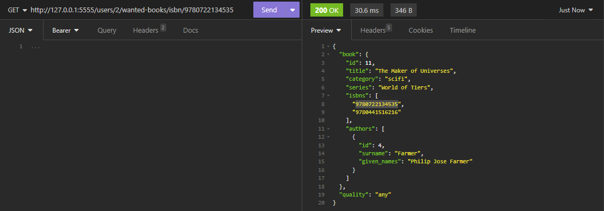
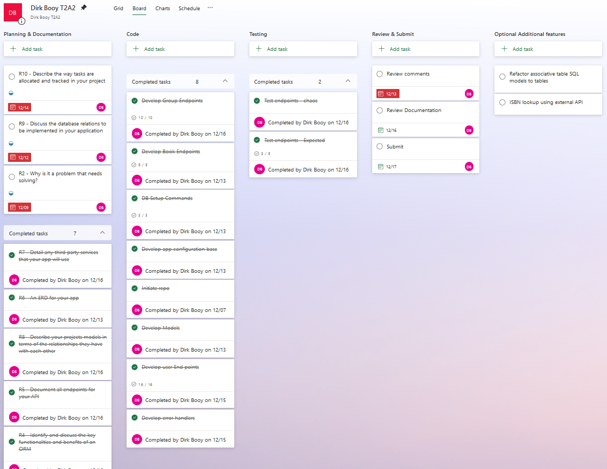

# Dirk Booy - T2A2 - API Webserver Project
[Github link: https://github.com/dtbooy/T2A2-API-Webserver-Project](https://github.com/dtbooy/T2A2-API-Webserver-Project)

## Contents
* [Installation instructions](#Installation-instructions)
* [R1 Problem Identification](#R1-Problem-Identification)
* [R2 Why is it a problem that needs solving?](#R2-Why-is-it-a-problem-that-needs-solving?)
* [R3 Database system choice](#R3-Database-system-choice)
* [R4 Key functionalities and benefits of an ORM](#R4-Key-functionalities-and-benefits-of-an-ORM)
* [R5 API Endpoints](#R5-API-Endpoints)
* [R6 ERD for the database](#R6-ERD-for-the-database)
* [R7 Third party services used](#R7-Third-party-services-used)	
* [R8 Description of App Models](#-R8-Description-of-App-Models)
* [R9 Database Relations in the Application](#R9-Database-Relations-in-the-Application)
* [R10 Project Management - Task allocation and tracking](#R10-Project-Management---Task-allocation-and-tracking)

# Installation instructions
## Database setup
from terminal open Postgres

```sudo -u postgres psql```

Create the bookshelf database with the command:

```CREATE DATABASE bookshelf;```

Connect to the database

```\c bookshelf```

Create bookshelf_dev user (replace < password > with chosen password)

```create user bookshelf_dev with password '< password >';```

Grant database privileges to bookshelf_dev

```grant all privileges on database trello to trello_dev```
```grant create on schema public to trello_dev```

## Environment files setup
1. Setup python virtual environment `python3 -m venv .venv`
    - If virtual environment is not automatically activated run - `source .venv/bin/activate`
1. Install required packages `pip install -r requirements.txt` 
1. rename ./src/.env_sample to ./src/.env
1. in the .env file update <password> in the DB_URI parameter to the password created for the bookshelf_dev user
1. in the .env file update <SECRET KEY> in the SECRET_KEY parameter to a chosen secret key (this is used to encrypt the jwt tokens).
1. rename ./src/.flaskenv_sample to ./src/.flaskenv

## Start up application
1. in the terminal navigate to the ./src folder
1. Create the database tables with the command ```flask db create```
1. Seed the database table with the command ```flask db seed```
1. Start the flask app with the command ```flask run```

the app should be running at http://127.0.0.1:5555


# R1 Problem Identification
The Lifeline Bookfest, the largest second-hand book sale in the southern hemisphere, offers a vast array of over a million books loosely organized into categories. It is a great opportunity to expand your book collection with minimal expenditure. However, for avid book enthusiasts, managing a substantial collection can lead to challenges such as unintentional duplicate purchases. Another challenge when going in groups it can be hard to manage what books people are looking for and which ones they already own. 

In response to these challenges, the proposed application aims to empower users to efficiently catalog the books they own and maintain a wish list of desired titles. These list will not only serve as a personal reference but will also be shareable among friends.

# R2 Why is it a problem that needs solving?
The challenges faced by avid book enthusiasts during events like the Lifeline Bookfest highlight the need for a solution to streamline the management of personal book collections. The sheer volume and diversity of books available at such events make it easy for individuals to lose track of their existing collection, leading to unintended duplicate purchases. This not only results in unnecessary expenses but also diminishes the overall enjoyment of the book-buying experience.

Moreover, the lack of a centralized system to track and share book lists makes it difficult for users to actively collaborate with friends in the pursuit of specific books. By addressing these challenges, our proposed application seeks to enhance the overall experience of book enthusiasts, promoting a more organized, cost-effective, and collaborative approach to exploring and expanding personal libraries during large-scale book sales.

# R3 Database system choice

The database system I have chosen to use is PostgreSQL 
This DBMS was chosen due to the following considerations:
* __Relational DBMS:__ PostgreSQL, being a relational DBMS is designed to handle structured data. This application involves storing of book data, which is structured data with well-defined relationships, making an RDBMS an appropriate choice. An alternative option could be to store the isbn:book_id table in a separate Key-Value Store Database which would have advantages in speed and scalability for the ISBN lookup feature, however the current proposed scale of the app would make these advantages negligible compared to the added complexity involved.
* __Price:__ The application in its current form has a very limited capacity to generate any money, being a niche application with a relatively limited user pool for looking for second hand books. This requires that the cost base for this application need to be practically nil for it to be viable. Conveniently PostgreSQL is a free open source object-relational database management system commonly used in web applications. Which makes it a great choice for this project.
* __Stability:__ PostgreSQL has been in active development for over 37 years making it a mature and stable database system. 
* __Documentation__: PostgreSQL has an active community providing support, documentation, and continuous improvement. With the maturity of the system it is likely there will be documented  solutions available for the majority of issues encountered.
* __Standards Compliance:__ PostgreSQL is ACID compliant which provides transactional integrity.
* __Scalability:__ While the current proposed form of the application is quite specific, there is potential that the scope may be expanded in a more general purpose direction (other books fairs, or expanding into a community based application with book reviews). As such, while a low priority, the capacity to scale needs to be a consideration. PostgreSQL can handle large amounts of data and is designed to scale both vertically and horizontally. Setting up and managing replication can be more complex compared to some other database systems
* __Stability:__ PostgreSQL is considered to be highly reliable and stable and generally performs well on read-intensive applications;
* __Security:__ PostgreSQL offers robust security features, including SSL certificates, data encryption, and role-based access control. Other paid DBMS may have additional security related  features, however the PostgreSQL offering is considered more than adequate for the current application


### References
* https://www.trustradius.com/products/postgresql/ 
* https://cloud.google.com/learn/postgresql-vs-sql
* https://db-engines.com/en/system/PostgreSQL 
* https://www.cockroachlabs.com/blog/limitations-of-postgres/
* https://www.sprinkledata.com/blogs/postgres-vs-oracle-an-in-depth-comparison-for-database-management


# R4 Key functionalities and benefits of an ORM
Object-Relational Mapping (ORM) is a framework that simplifies the between an Object Oriented Programing (OOP) language and a relational database. It creates a level of abstraction away from the database layer, allowing the developer to interact using their preferred programming language.

The key functionalities and benefits of an ORM are:
* __Object Relational Mapping__: an ORM Maps database tables and records to objects in the chosen OOP language. This makes it simpler to work with data in an OOP language, as the ORM handles the translation between the database structure and the OOP model.
* __Abstraction of Database Operations:__ ORM systems abstract away much of the boilerplate code associated with database interactions. As well as saving time this allows code to be written database independently, allows for flexibility in choosing the right database system for the application and making it easier to switch between different database engines without significant code changes.
* __CRUD Operations:__ an ORM allows database operations (Create, Read, Update & Delete) to be written using object-oriented syntax, making code more readable and maintainable.
* __Sanitation of Inputs__: Most ORMs will provide mechanisms to parameterise queries. This helps to mitigate the risk of SQL injections, improving security.

## References
* https://www.freecodecamp.org/news/what-is-an-orm-the-meaning-of-object-relational-mapping-database-tools/
* https://www.altexsoft.com/blog/object-relational-mapping/
* https://blog.bitsrc.io/what-is-an-orm-and-why-you-should-use-it-b2b6f75f5e2a


# R5 API Endpoints
The figure below outlines the applications routes and CRUD operation endpoints:
 

## 1. /login (POST)
* __HTTP Request Verb:__ POST
* __Required Fields:__ username, password
* __Expected response Code:__ 200, OK
* __Expected response Fields:__ username, token
* __Authentication methods:__ username, password
* __Description:__ Allows user to login to app.


## 2. /register (POST) 
* __HTTP Request Verb:__ POST
* __Required fields:__ username, password
* __Optional fields:__ email
* __Expected response Code:__ 201, Created
* __Expected response Data:__ id, username, email, token
* __Description:__ Allows user to create an account. Returns bearer token (automatically logs in new user)

 

## 3. /users/ (GET)
* __HTTP Request Verb:__ GET
* __Required body:__ N/A
* __Expected response Code:__ 200 OK
* __Expected response fields:__ ALL Users(id, username, email, groups)
* __Authentication methods:__ @jwt_required, is_admin()
* __Description:__ Admin only: Retrieves details of all users

 


## 4. /users/<user_id> (GET)
* __HTTP Request Verb:__ POST
* __Required body:__ N/A 
* __Expected response Code:__ 200 OK
* __Expected response Data:__ data for single user (id, username, email, groups)
* __Authentication methods:__ @jwt_required, is_user_or_admin(id)
* __Description:__ allows a logged in user to see their own user details

 


## 5. /users/<user_id> (PATCH, PUT) 
* __HTTP Request Verb:__ PATCH, PUT
* __Optional fields:__ password, email
* __Expected response Code:__ 200 OK
* __Expected response Data:__ (id, username, email)
* __Authentication methods:__ @jwt_required, is_user_or_admin(id)
* __Description:__ Updates record <user_id> with provided email or password. 

 


## 6. /users/<user_id> (DELETE) 
* __HTTP Request Verb:__ DELETE
* __Required body:__ N/A
* __Expected response Code:__ 204, No Content
* __Expected response Data:__ N/A
* __Authentication methods:__ @jwt_required, is_user_or_admin(id)
* __Description:__ Deletes account with user id <user_id> 

 


## 7. /users/<user_id>/owned-books/ (GET)
* __HTTP Request Verb:__ GET
* __Required body:__ N/A
* __Expected response Code:__ 200 OK
* __Expected response Data:__ owned_books: [list of nested book details]
* __Authentication methods:__ @jwt_required, is_user_or_admin(id)
* __Description:__ returns a list of all the book titles owned by the user user_id. (user <user_id> or admin)

 


## 8. /users/<user_id>/owned-books/ (POST)
* __HTTP Request Verb:__ POST
* __Required field:__ book_id
* __Expected response Code:__ 201, CREATED
* __Expected response Data:__ details of book that was added to owned books
* __Authentication methods:__ @jwt_required, is_user_or_admin(id)
* __Description:__ Adds a book to <user_id> owned books

 


## 9. /users/<user_id>/owned-books/<book_id> (DELETE)
* __HTTP Request Verb:__ DELETE
* __Required body:__ N/A
* __Expected response Code:__ 204, No Content
* __Expected response Data:__ N/A
* __Authentication methods:__ @jwt_required, is_user_or_admin(id)
* __Description:__ removes a book entry from owned books

 


## 10. /users/<user_id>/owned-books/isbn/<isbn> (GET)
* __HTTP Request Verb:__ GET
* __Required body:__ N/A
* __Expected response Code:__ 200 OK
* __Expected response Data:__ {} or book details
* __Authentication methods:__ @jwt_required, is_user_or_admin(id)
* __Description:__ Allows user to enter the ISBN of a book and see if it is in their owned_books. Will return {} if book not in owned books or the book details if it is in <user_id> owned_books. 
_Note: if ISBN is not in books table will return a 404 error._

 


## 11. /users/<user_id>/wanted-books/ (GET)
* __HTTP Request Verb:__ GET
* __Required body:__ N/A
* __Expected response Code:__ 200, OK
* __Expected response Data:__ nested list books in <user_id>'s wanted books
* __Authentication methods:__ @jwt_required, is_user_or_admin(id)
* __Description:__ Returns list of books that are in <user_id> wanted_books list

 


## 12. /users/<user_id>/wanted-books/ (POST)
* __HTTP Request Verb:__ POST, PATCH, or PUT
* __Required fields:__ book_id(int) 
* __Optional fields:__ quality(must be "any", "fair", "good", "mint". default value = "any")
* __Expected response Code:__ 201, CREATED
* __Expected response Data:__ returns book details & quality
* __Authentication methods:__ @jwt_required, is_user_or_admin(id)
* __Description:__ Adds book to <user_ids> wanted book list.

 


## 13. /users/<user_id>/wanted-books/<book_id> (DELETE)
* __HTTP Request Verb:__ DELETE
* __Required body:__ N/A
* __Expected response Code:__ 204, NO CONTENT
* __Expected response Data:__ N/A
* __Authentication methods:__ @jwt_required, is_user_or_admin(id)
* __Description:__ Removes book from user_id wanted books list.

 


## 14. /users/<user_id>/wanted-books/categories/<category> (GET)
* __HTTP Request Verb:__ GET
* __Required body:__ N/A
* __Expected response Code:__ 200, OK
* __Expected response Data:__ Nested list of books in users wanted_books list in requested category
* __Authentication methods:__ @jwt_required
* __Description:__ Returns <user_id> wanted books in specified <category>.  

 


## 15. /users/<user_id>/wanted-books/isbn/<isbn> (GET)
* __HTTP Request Verb:__ POST
* __Required body:__ N/A
* __Expected response Code:__ 200, OK
* __Expected response Data:__ Book details & quality wanted if book in users wanted list, else no content {}.
* __Authentication methods:__ @jwt_required
* __Description:__ Allows user to enter book ISBN and see if the book is in <user_id> wanted books list.

 


## 16. /books/ (POST)
* __HTTP Request Verb:__ POST
* __Required fields:__ title, [isbns], [author_ids] 
* __Optional fields:__ series, category
* __Expected response Code:__ 201, CREATED
* __Expected response Data:__ book details, fields [id, title, category, series, isbns(nested list), author_ids(nested list)]
* __Authentication methods:__ @jwt_required
* __Description:__ Adds a book to the database, will also add associated entries in the book_authors table, and isbns table.

 


## 17. /books/ (GET) 
* __HTTP Request Verb:__ GET
* __Required body:__ N/A
* __Expected response Code:__ 200, OK
* __Expected response Data:__ All books in the database fields [id, title, category, series, isbns(nested list), author_ids(nested list)]
* __Authentication methods:__ @jwt_required, is_admin()
* __Description:__ Returns all books in database.

 


## 18. /books/<book_id> (GET) 
* __HTTP Request Verb:__ GET
* __Required body:__ N/A
* __Expected response Code:__ 200, OK
* __Expected response Data:__ <book_id> details: fields[id, title, category, series, isbns(nested list), author_ids(nested list)]
* __Authentication methods:__ @jwt_required
* __Description:__ Gets a single book details based on <book_id>.

 


## 19. /books/<book_id> (PATCH)
* __HTTP Request Verb:__ PATCH
* __Optional fields__ title, [isbns], [author_ids] 
* __optional fields__ series, category
* __Expected response Code:__ 200, OK
* __Expected response Data:__ book details, fields [id, title, category, series, isbns(nested list), author_ids(nested list)]
* __Authentication methods:__ @jwt_required, is_admin()
* __Description:__ updates book record in the database, will also add associated entries in the book_authors table, and isbns table.

 


## 20. /books/<book_id> (DELETE) 
* __HTTP Request Verb:__ DELETE
* __Required body:__ N/A
* __Expected response Code:__ 204, No Content
* __Expected response Data:__ N/A
* __Authentication methods:__ @jwt_required, is_admin()
* __Description:__ Deletes book record from database.

 

## 21. /authors/ (GET) 
* __HTTP Request Verb:__ GET
* __Required body:__ N/A
* __Expected response Code:__ 200, OK
* __Expected response Data:__ list of authors (nested[id, surname, given_names])
* __Authentication methods:__ @jwt_required
* __Description:__ Returns a list of authors & details in the database.

 

## 22. /authors/ (POST) 
* __HTTP Request Verb:__ POST
* __required fields:__ surname 
* __optional fields:__ given_names
* __Expected response Code:__ 201, CREATED
* __Expected response Data:__ author details [id, surname, given_names]
* __Authentication methods:__ @jwt_required, is_admin()
* __Description:__ Adds a new Author to the database.

 

## 23. /authors/<author_id> (PATCH, PUT) 
* __HTTP Request Verb:__ PATCH, PUT
* __Optional fields:__ surname, given_names
* __Expected response Code:__ 200, OK
* __Expected response Data:__ author details [id, surname, given_names]
* __Authentication methods:__ @jwt_required, is_admin()
* __Description:__ Updates an existing author in the database.

 

## 24. /authors/<author_id> (DELETE) 
* __HTTP Request Verb:__ DELETE
* __Required body:__ N/A
* __Expected response Code:__ 204, NO CONTENT
* __Expected response Data:__ N/A
* __Authentication methods:__ @jwt_required, is_admin()
* __Description:__ Deletes author from database (will cascade delete any entries in book_author table where author id = <author_id>)

 

## 25. /groups/ (GET)
* __HTTP Request Verb:__ GET
* __Required body:__ N/A
* __Expected response Code:__ 200, OK
* __Expected response fields:__ all groups(id, name, users(id, username), admin_id)
* __Authentication methods:__ @jwt_required, is_admin()
* __Description:__ Returns a list of all groups and their members.

 

## 26. /groups/<group_id> (GET) 
* __HTTP Request Verb:__ GET
* __Required body:__ N/A
* __Expected response Code:__ 200, OK
* __Expected response Data:__ group (id, name, users(id, username), admin_id)
* __Authentication methods:__ @jwt_required 
* __Description:__ Returns <group_id> details

 

## 27. /groups/ (POST) 
* __HTTP Request Verb:__ POST
* __Required fields:__ name 
* __Optional fields__ password, admin_id
* __Expected response Code:__ 201, CREATED
* __Expected response Data:__ Selected Group details. Fields: group(id, name, users(id, username), admin_id)
* __Authentication methods:__ @jwt_required 
* __Description:__ Creates a group (and adds group creator user_id as member). If not admin_id is provided, default is the user id associated with the JWT Bearer Token. If no password is provided the group will be open for any user to join.

 

## 28. /groups/<group_id> (DELETE) 
* __HTTP Request Verb:__ DELETE
* __Required body:__ N/A
* __Expected response Code:__ 204, No CONTENT
* __Expected response Data:__ N/A
* __Authentication methods:__ @jwt_required, is_user_group_admin_or_admin(user_id, group_id)
* __Description:__ Deletes group, delete cascades related records in user_group table.

 

## 29. /groups/<group_id> (PATCH, PUT) 
* __HTTP Request Verb:__ PATCH, PUT
* __Optional fields:__ name, password, admin_id
* __Expected response Code:__ 200, OK
* __Expected response Data:__ Updated group details. Fields: group(id, name, admin_id)
* __Authentication methods:__ @jwt_required, is_user_group_admin_or_admin(user_id, group_id)
* __Description:__ Updates group details: name, password, group administrator

 


## 30. /groups/<group_id> (POST) 
* __HTTP Request Verb:__ POST
* __Required Fields:__ password
* __Expected response Code:__ 201, CREATED
* __Expected response Data:__ Joined Group details. Fields: group(id, name, users(id, username), admin_id)
* __Authentication methods:__  @jwt_required, password
* __Description:__ Join group <group_id>. Requires group password if one has been set by group admin. 

 


## 31. /groups/<group_id>/members/<user_id> (DELETE)
* __HTTP Request Verb:__ DELETE
* __Required body:__ N/A
* __Expected response Code:__  204, NO CONTENT
* __Expected response Data:__ N/A
* __Authentication methods:__ @jwt_required, is_user_group_admin_or_admin(user_id, group_id) 
* __Description:__ Removes member from group. Can be performed by the group admin ot DB administrator

 


## 32. /groups/<group_id>/wanted_books (GET) 

* __HTTP Request Verb:__ GET
* __Required body:__ N/A
* __Expected response Code:__ 200, OK
* __Expected response Data:__ List of users and all wanted books: [username, wanted_book(book(book details), quality), ]
* __Authentication methods:__ @jwt_required. is_group_or_admin(group_id)
* __Description:__ Returns all the books in the group members wanted_books lists

 


# R6 ERD for the database
 

## Notes on Table normalistaion
It should be noted that technically to fully normalise the books table, both the series and category attributes could be split into their own tables, each with a one to many relationship. This would reduce data redundancy within the books table. However it was decided however that for this application this would be not be appropriate due to:
* Simplicity - both the series name and the category attributes are single data point attributes. No other information about this is stored in the database.
* Stability of data - these two attributes are very unlikely to change for existing records, making one of the major advantages of normalisation, easier data management, a moot point.
* Application of series & category data - the application has no other purpose to access series & category data external to it's association with a book record. Conversely in most situations, when accessing a book record, the associated category and series title records would need to be accessed as well.
Given the above it was decided that splitting these attributes into their own tables would be introducing unnecessary complexity and potentially a minor loss to performance to the application fora largely moot benefit.

# R7 Third party services used
## Flask 
Flask is a lightweight web framework for Python. It simplifies the creation of web applications, emphasising simplicity and flexibility. There are also many extensions available for Flask, adding additional functionality, such as ORMs, encryption, and authentication. For this application, the following Flask extensions were employed:

### SQL Alchemy 
Flask-SQLAlchemy is an extension for Flask that integrates the SQLAlchemy, a python ORM library. SQL Alchemy streamlines the creation of database models and facilitates database operations within the app.

### Flask-Marshmallow 
Flask-Marshmallow is an extension that integrates the Marshmallow python library with Flask. The Marshmallow library enables schema validation, serialization, and deserialization of complex data structures. It is used within the app for data validation and transforming data between Python objects (ORM object) and JSON (output).

### Flask-JWT-Extended
Flask-JWT-Extended is an extension for Flask that is used in the app to implement JSON Web Tokens (JWT) for user authentication and authorisation. 

### Bcrypt
Bcrypt is a password-hashing library commonly used for securely storing passwords in databases.

## Postgresql
PostgreSQL is the Relational Database Management System (RDBMS) used for this app. It is an open-source RDBMS known for its extensibility, standards compliance, and advanced features.

## Psycops2 
Psycopg2 is a PostgreSQL adapter for Python, providing efficient and robust connectivity to PostgreSQL databases. 

# R8 Description of App Models
The Application has 9 Models, representing the 9 tables in the database:
* Book
* Isbn
* Author
* BookAuthor
* User
* UserModel
* WantedBook
* Group
* UserGroup

## Book Model
The Book model represents the books table in the database for the app. It contains records on books. It has the following relationships with other models:
* a one to many relationship with the Isbn model, which holds records on ISBNs and the associated book_id (linked to the Books model via the primary key)
* a  one to many relationship with the BookAuthor model. The BookAuthor model acts in the role of a join table representing a many to many relationship between the Book model and Author model.
* a one to many relationship with both the UserBook model and WantedBook model. These models act in the role of a joint table representing many to many relationship between the Book model and User model, namely the records of books a user owns (UserBook) and books a user wants (WantedBook).

These many to one relationships are bi-directional, allowing for convenient querying from both sides. These relationships are also all contingent on the existence of the book data (ie: a record in the Isbn, BookAuthor, UserBook or WantedBook models cannot exist without a corresponding reference to a record in the Book model). Foreign keys for these records are in their respective tables referencing the primary key in Books (books.id). To ensure no orphan data is created on deletion of a book record, each of these four relationships contains the ```cascade="all, delete-orphan"``` property, which means SLQ Alchemy will cascade delete the associated orphan records in these tables created when deleting a record from the book model.

```py
class Book(db.Model):
    # Table name
    __tablename__ = "books"
    # Primary Key
    id = db.Column(db.Integer, primary_key=True)
    # Attributes
    title = db.Column(db.String, nullable=False)
    category = db.Column(db.String)
    series = db.Column(db.String)    
    # Relationships
    authors = db.relationship(
        "BookAuthor", back_populates="book", cascade="all, delete-orphan")
    isbns = db.relationship(
        "Isbn", back_populates="book", cascade="all, delete-orphan")
    users_books = db.relationship(
        "UserBook", back_populates="book", cascade="all, delete-orphan")
    wanted_books = db.relationship(
        "WantedBook", back_populates="book", cascade="all, delete-orphan")
```

## Isbn Model
The Isbn model represents the isbns table in the database. It contains a register of all ISBNs and their associated book. It has a many to one relationship with the Book model (one book can have many ISBNs, but an ISBN is associated with only one book). The primary key for this model is the ISBN (a unique identifier for a book publication). The foreign key linking to the Book model is book_id, which references Primary Key field in the Book model (books.id). The Foreign key field sets a cascade on delete property to set the DBMS to delete records in the isbn table when a referenced record in the Books table is deleted. While this will be handled in the app through SLQ alchemy using the ```cascade='all', 'delete-orphan'``` property in the Book-Isbn Model relationship in the Books Model, the FK property ensure the DBMS will replicate this if the data is manipulated outside of the API. It is considered good practice to implement both methods, and this has been replicated through all the models where applicable.
```py
class Isbn(db.Model):
    # Table name
    __tablename__ = "isbns"
    # PK
    isbn = db.Column(
        db.String(13), primary_key=True, autoincrement=False)
    # FK
    book_id = db.Column(db.Integer, db.ForeignKey(
        "books.id", ondelete='CASCADE'), nullable=False)
    # Relationships
    book = db.relationship("Book", back_populates="isbns")
```

## Author Model
The Author model represents the authors table which contains data on authors (first_names, and surnames). It has a one to many bidirectional relationship with the BookAuthor Model. The BookAuthor model is a join table representing the many to many relationship between Authors and books. The Author BookAuthor SQLAlchemy relationship has is set to cascade delete associated records in the BookAuthor model on delete of an Author record.

NOTE: In this structure, if an author is deleted, book records can be left without an author record. This doesn't break any of the current functionality of the application, it will need to be understood from a database management / maintenance perspective when data handling policies and procedures are developed to ensure data integrity.
```py
class Author(db.Model):
    # Table name
    __tablename__ = "authors"
    # PK
    id = db.Column(db.Integer, primary_key=True)
    # Attributes
    surname = db.Column(db.String, nullable=False)
    given_names = db.Column(db.String)
    # Relationships
    authors = db.relationship(
        "BookAuthor", back_populates="author", cascade="all, delete-orphan")
```


## BookAuthor Model 
The BookAuthor model represents the books_authors table. This is a join table representing the many to many relationship between the Authors and Books Models. It contains a each record registers an instance of an author record and a book record. As such it contains one to many relationships (bidirectional) with both the Book model and the Author model. The model construct has two foreign keys author_id (referencing the primary key in the Author model, authors.id) and book_id (referencing the primary key in the Book model books.id). Each of these foreign keys has the ```ondelete="CASCADE"``` property, which will remove records in the BookAuthor table when an associated Book or Author record is deleted within the DBMS.
```py
class BookAuthor(db.Model):
    # Table name
    __tablename__ = "books_authors"
    # PK
    id = db.Column(db.Integer, primary_key=True)
    # FKs
    author_id = db.Column(db.Integer, db.ForeignKey(
        "authors.id", ondelete='CASCADE'), nullable=False)
    book_id = db.Column(db.Integer, db.ForeignKey(
        "books.id", ondelete='CASCADE'), nullable=False)
    # Relationships
    author = db.relationship("Author", back_populates="authors")
    book = db.relationship("Book", back_populates="authors")
```

## User Model
The User model represents the users table which contains data relating to the user. It has the following relationships with other models:
* a one to many relationship with the UserGroup model. The UserGroup model acts in the role of a join table representing a many to many relationship between the User model and Groups model.
* a one to many relationship with both the UserBook model and WantedBook model. 
* These models act in the role of a joint table representing many to many relationship between the User model and the Book model, namely the records of books a user owns (UserBook) and books a user wants (WantedBook).
These relationships are bi-directional, with the ```cascade="all, delete-orphan"``` property, which will cascade record deletion form the User Model to associated records in the UserGroup, UserBook and WantedBook Models.

```py
class User(db.Model):
    # Table name
    __tablename__ = "users"
    # PK
    id = db.Column(db.Integer, primary_key=True)
    # Attributes
    username = db.Column(db.String, nullable=False, unique=True)
    password = db.Column(db.String, nullable=False)
    email = db.Column(db.String, unique=True)
    is_admin = db.Column(db.Boolean, default=False)
    # Relationships
    groups = db.relationship(
        "UserGroup", back_populates="user", cascade="all, delete-orphan")
    owned_books = db.relationship(
        "UserBook", back_populates="user", cascade="all, delete-orphan")
    wanted_books = db.relationship(
        "WantedBook", back_populates="user", cascade="all, delete-orphan")
```

## UserBook Model
The UserBook model represents the users_books table in the database for the app. This is a join table for a many to many relationship between the users table and the books table. It contains a register of what users own which books. As such the UserBook model has two bidirectional one to many relationships with the User model and Books model respectively. 

The model defines these to the DBMS with the foreign keys user_id (which references primary key in the User Model, the user.id column) and book_id (which references primary key in the Book model, the book.id column). These Foreign Keys also have the ```ondelete='CASCADE'``` property, means the DBMS will delete a record in the users_books table if either of their referenced records is deleted in the foreign tables. 

```py
class UserBook(db.Model):
    # Table name
    __tablename__ = "users_books"
    # Attributes
    id = db.Column(db.Integer, primary_key=True)
    # FKs
    user_id = db.Column(db.Integer, db.ForeignKey(
        "users.id", ondelete='CASCADE'), nullable=False)
    book_id = db.Column(db.Integer, db.ForeignKey(
        "books.id", ondelete='CASCADE'), nullable=False)
    # Relationships
    user = db.relationship("User", back_populates="owned_books")
    book = db.relationship("Book", back_populates="users_books")
```

## WantedBook Model
The WantedBook model represents the wanted_books table in the database for the app. This is a join table for a many to many relationship between the users table and the books table. It contains a register of which books are wanted by which users, and the desired quality of the book. As such the WantedBook model has two bidirectional one to many relationships with the User model and Books model respectively. 

The model defines these to the DBMS with the foreign keys user_id (which references primary key in the User Model, the user.id column) and book_id (which references primary key in the Book model, the book.id column). These Foreign Keys also have the ```ondelete='CASCADE'``` property, means the DBMS will delete a record in the users_books table if either of their referenced records is deleted in the foreign tables. 
```py
class WantedBook(db.Model):
    # Table name
    __tablename__ = "wanted_books"
    # Attributes
    id = db.Column(db.Integer, primary_key=True)
    quality = db.Column(db.String, default="any")
    # FKs
    user_id = db.Column(db.Integer, db.ForeignKey(
        "users.id", ondelete='CASCADE'), nullable=False)
    book_id = db.Column(db.Integer, db.ForeignKey(
        "books.id", ondelete='CASCADE'), nullable=False)
    # Relationships
    user = db.relationship("User", back_populates="wanted_books")
    book = db.relationship("Book", back_populates="wanted_books")
```

## Group Model
The Group model represents the groups table in the database for the app. This table contains information regarding the groups. The model has one bidirectional many to one relationship with the UserGroup Model (The UserGroup model being a join table representing a many to many relationship between the User and Group Models). 

This relationship has the ```cascade="all, delete-orphan" ``` set, which means the app will cascade the deletion of Group records to the associated records in the UserGroup model. 
The Groups model also defines a foreign key (admin_id) referencing the users.id column in the Users model. This relationship isn't defined as a bidirectional relationship in SQLAlchemy as this is not required in the functionality of the app. It does have the ```ondelete='CASCADE'``` property, means the DBMS will delete the group if the group admin user account is deleted. As described above, this will further cascade to delete all associated references to the group in the users_groups table.
```py
class Group(db.Model):
    # Table name
    __tablename__ = "groups"
    # PK
    id = db.Column(db.Integer, primary_key=True)
    # Attributes
    name = db.Column(db.String, nullable=False)
    password = db.Column(db.String)
    # FKs
    admin_id = db.Column(db.Integer, db.ForeignKey("users.id"), nullable=False)
    # Relationships
    users = db.relationship(
        "UserGroup", back_populates="group", cascade="all, delete-orphan")
```

## UserGroup Model
The UserGroup model represents the users_groups table in the database for the app. This is a join table for a many to many relationship between the users table and the groups table. It contains a register of what users belong to which groups. As such the UserGroup model has two bidirectional one to many relationships with the User model and Groups model respectively. 

The model defines these to the DBMS with the foreign keys user_id (which references primary key in the User Model, the user.id column) and group_id (which references primary key in the Group model, the group.id column). These Foreign Keys also have the ```ondelete='CASCADE'``` property, means the DBMS will delete a record in the users_groups table if either of their referenced records is deleted in the foreign tables. 
```py
class UserGroup(db.Model):
    # Table name
    __tablename__ = "users_groups"
    # Attributes
    id = db.Column(db.Integer, primary_key=True)
    # FKs
    user_id = db.Column(db.Integer, db.ForeignKey(
        "users.id", ondelete='CASCADE'), nullable=False)
    group_id = db.Column(db.Integer, db.ForeignKey(
        "groups.id", ondelete='CASCADE'), nullable=False)
    # Relationships
    user = db.relationship("User", back_populates="groups")
    group = db.relationship("Group", back_populates="users")
```

# R9 Database Relations in the Application
For this application a database balled bookshelf was developed. It is represented pictorially in the following Chen ERD.
 

The database contains a total of 9 tables:
1. __users:__ The users table contains information about the apps users, mostly for authentication and authorisation purposes. It contains the following attributes:
    * id - this is the tables primary key and hold a unique identifier for each user
    * username - this is the users username. it has a unique constraint (each user will need to ahave a unique username) 
    * email - this holds the users email adress - this is an optional field
    * is_admin - this is a boolean attribute indicating whether the user is an administrator for the app. Administrators have full access to all the data in the database. Administrator privileges cannot be set through the API  and must be set in the database directly.
    * password - this stores a hash of the the users password. 
1. __books:__  the books table contain data on books (except for authors and isbns which where split into their own tables during normalisation). It contains the following attributes:
    * id - primary key for the table - unique identifier for a book record.
    * title - the books title.
    * category - the category the book belongs to.
    * series - the series (if any) that the book belongs to 
1. __groups:__ - the groups table contains records regarding groups. Groups are the mechanism to share wanted books within the application. It contains the following attributes:
    * id - primary key for the table - unique identifier for a group record.
    * name - the name of the group (required, must be unique)
    * password - the password required to join the group (optional)
    * group_admin - the user_id of the group administrator. the group administrator can remove members & change the group details. This attribute has a foreign key constraint linking it to the primary key in the users table (users.id) and an on delete cascade set, which will delete the group if the group_admin user is deleted. 
1. __authors:__ the authors table contains records relating to authors of books. It contains the following attributes:
    * id - primary key for the table - unique identifier for an author record.
    * surname - authors surname (required)
    * given_names - authors given names (optional)
1. __isbns:__ the isbns table contains records of all the isbns and their associated book. It has a one to many relationship with the books table. It contains the following attributes:
    * isbn - primary key for the table - unique identifier for a book.
    * book_id - the id of the book that corresponds to the isbn. this is a foreign key referencing the primary key in the books table (book.id) this has an on delete cascade, which will delete the isbn if it associated book record is deleted.  
1. __user_groups:__ the user_groups table is a join table which represents the many to many relationship between the users table and groups table. It's records represent an association between a group and a user. It contains the following attributes:
    * id - primary key for the table - unique identifier for an author record.
    * user_id - foreign key referencing the user table primary key (users.id). On delete cascade set, which will delete the user_group record if the associated user is deleted.
    * group_id - foreign key referencing the group table primary key (group.id). On delete cascade is set, which will delete the user_group record if the associated group is deleted.
 
1. __users_books:__ The users_books table is a join table representing a many to many relationship between users table and the books table. A user_books record represents the user owning the associated book. It contains the following attributes:
    * id - primary key for the table - unique identifier for an author record.
    * user_id - foreign key referencing the user table primary key (users.id). On delete cascade set, which will delete the users_books record if the associated user is deleted.
    * book_id - foreign key referencing the book table primary key (book.id). On delete cascade is set, which will delete the users_books record if the associated book is deleted.
1. __wanted_books:__ The wanted_books table is a join table representing a many to many relationship between users table and the books table. A wanted_books record represent the user wanting the associated book. It contains the following attributes:
    * id - primary key for the table - unique identifier for an author record.
    * user_id - foreign key referencing the user table primary key (users.id). On delete cascade set, which will delete the wanted_books record if the associated user is deleted.
    * book_id - foreign key referencing the book table primary key (book.id). On delete cascade is set, which will delete the wanted_books record if the associated book is deleted.
1. __books_authors:__ The books_author table is a join table representing a many to many relationship between authors table and the books table. A books_authors record associates an author record with a book record. the table contains the following attributes:
    * id - primary key for the table - unique identifier for an author record.
    * author_id - foreign key referencing the user table primary key (authors.id). On delete cascade set, which will delete the books_authors record if the associated author is deleted.
    * book_id - foreign key referencing the book table primary key (book.id). On delete cascade is set, which will delete the books_author record if the associated group is deleted.

# R10 Project Management - Task allocation and tracking
For this project tasks were allocated and tracked using MS Planner. MS Planner offers a Kanban Board style planning solution, providing a visual representation of the project tasks. The program allows for tasks to be planned out in an overall project view, with customisable category columns. For this project I created 5 columns:
* Planning and Documentation
* Coding
* Testing
* Review & submit
* Optional additional features

The cards where created for the project tasks required in each of these categories. Each task was assigned an expected completion date and further broken down using a checklist of activities required for each task. As the project progressed the cards were updated to reflect required changes that came to bear during development due to unforeseen complexities. 

One of the features of MS Planner is the ability to assign cards to users, where they will appear in that user's specific board, which is set out in the traditional Kanban style (not started, in progress, completed). In order to track progress, I would assign cards to myself and track them through the user Kanban board as they progressed. 

MS planner also has a useful automated tracking dashboard which charts the projects progress highlighting any late tasks allowing an overview of the project status at a glance. This was useful in determining whether and how far the project fell behind the original projections, and estimating how much additional time & effort would be needed to catch up.

### Link to MS Planner Project
[Link to the MS planner project board](https://tasks.office.com/coderacademy.edu.au/Home/PlanViews/5KJ5JnuAnkOXcM8ron_qcggAH9ka?Type=PlanLink&Channel=Link&CreatedTime=638383075259180000)

### Project Board


### User Board


### Tracking Chart

